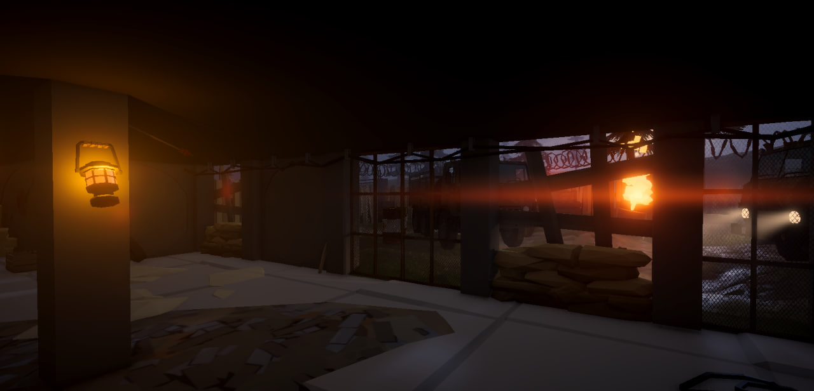
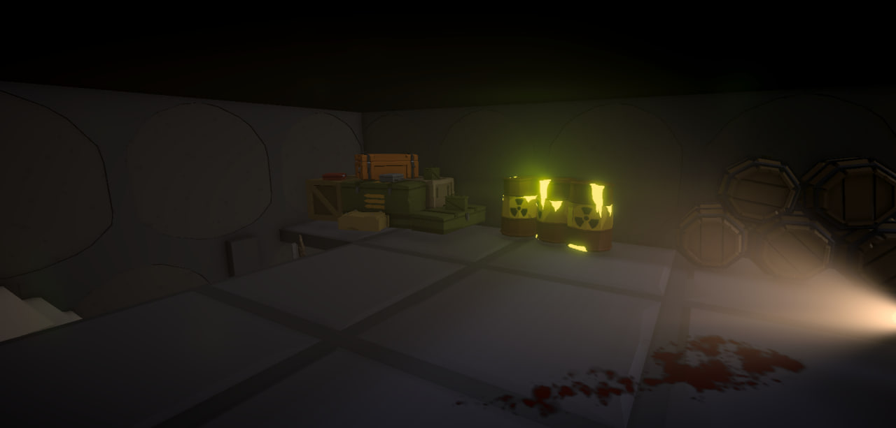
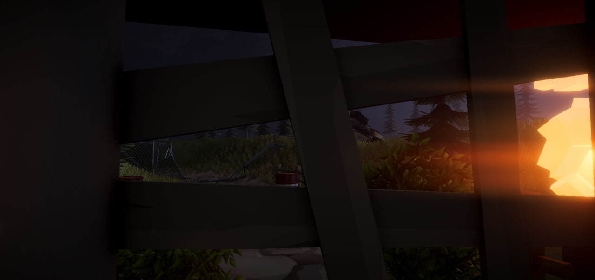
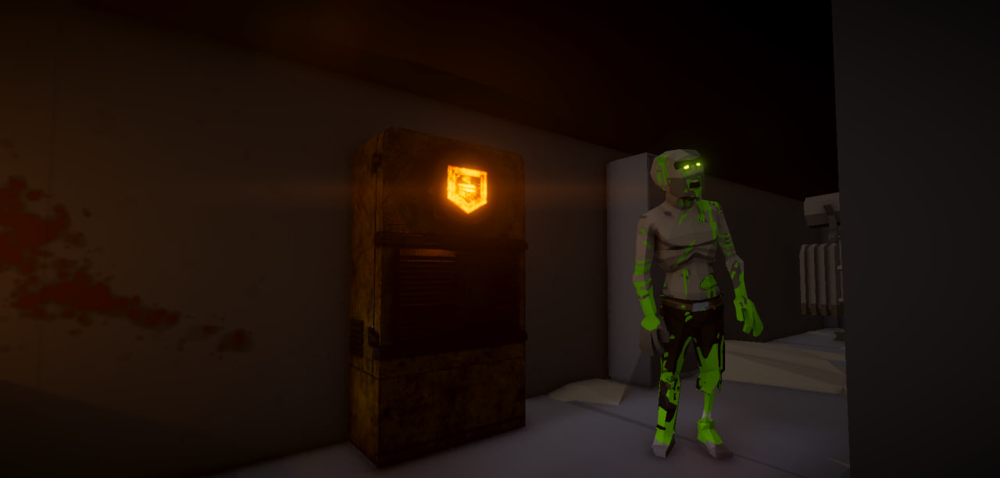

# Biohazard Protocol

🧟‍♂️**Biohazard Protocol** — это шутер на выживание по волнам, вдохновлённый классическим зомби-режимом из Call of Duty: Black Ops. Игрок сражается против бесконечных волн зомби, собирает ресурсы и улучшает оружие, чтобы продержаться как можно дольше.

🎮 **Особенности:**

• Волны зомби с постепенным усложнением.

• Система очков за убийства и возможность покупки оружия.

• Карты с закрытыми зонами, которые можно открывать за очки.

• Атмосферная музыка и визуальный стиль.

🚀 **Установка и запуск:**

• Клонируйте репозиторий: git clone https://github.com/GfgProfit/BiohazardProtocol.git

• Откройте проект в Unity (рекомендуемая версия 2022.x.x или новее).

• Запустите сцену Bootstrapper в редакторе.

• Нажмите Play, чтобы начать тестирование.

📝 **Планы развития:**

• Поддержка мультиплеера.

• Новые карты и уникальные боссы.

• Прокачка оружия (аналог Pack-a-Punch).

• Оптимизация и улучшение UI/UX.

🛠 **Технологии:**

• Unity (C#) — игровой движок.

• Unity Audio + Resonance Audio — звуковое оформление.

📜 **Лицензия:** Этот проект распространяется по лицензии Apache License 2.0.

🙌 **Авторы:**

• kagamitekiro/gfgprofit - Team Lead, main developer.

• Bablo3232 - FPS Animator.

• BlatnoyUnitaz228 - UI/UX Designer.
